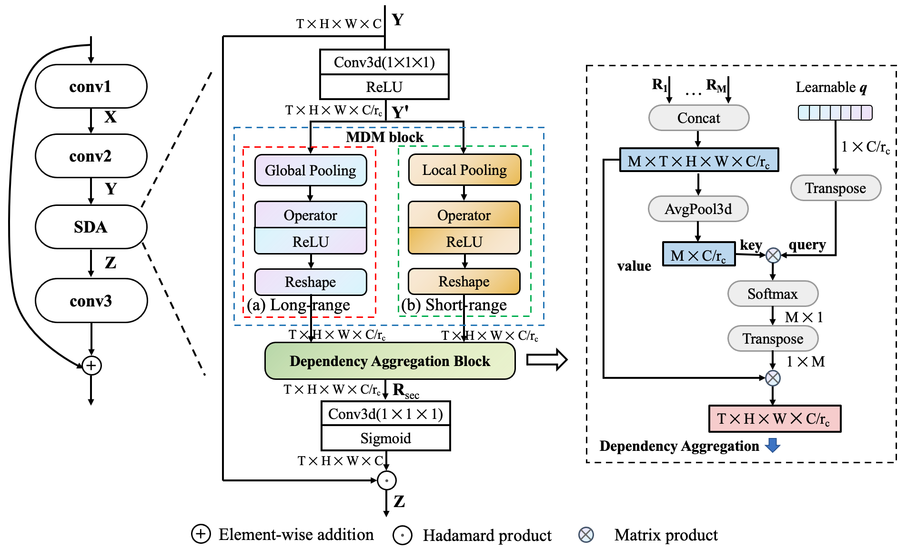

# Selective dependency aggregation for action classification
Implementation for MM21 paper "Selective dependency aggregation for action classification"(http://staff.ustc.edu.cn/~hexn/papers/mm21-SDA.pdf)

## Citation

## Introduction 

The 3D dynamic nature of video data widens the sphere of actions with an order of magnitude larger than the 2D static vision, resulting in multiple dependencies across space and time dimensions. Those dependencies contribute differently given different videos.

<div align="center">
  
</div>


Selective dependency aggregation(SDA) models the dynamic video dependency perference and further boost the performance of existng action classification models.


## Setups 
Build a folder with the following structrue:


```
DATASET_NAME
|_ category.txt
|  |_ img
|  |_ trainValTest
```

### Dataset Prepare
#### Something-something
1. Please download the dataset and annotations from [dataset provider](https://20bn.com/datasets/something-something).
2. Download the *category list* from the following links: ([category]())
3. Download the *frame list* from the following links: (V1:[train](), [val](), V2:[train](), [val]()).
4. Extract the raw file to folder img(V1); Extract the raw file and further extract the frames to folder img using [vid2img]()

#### Diving48

#### EPIC-KITCHEN55

### Requirements
- Python 3
- Pytorch1.8
- TensorboardX
- Thop

## Run
### Training 

```bash
python train.py
```

### Testing 
```bash
python test.py
```

## Results 

### Something-something
| Method       | Frames X Crops X Clips | #P    | FLOPs          | V1    | V2    |
|--------------|------------------------|-------|----------------|-------|-------|
| GST          | 8 x 1 x 1              | 21.0M | 29.5G x 1 x 1  | 47.0  | 61.6  |
| GST          | 16 x 1 x 1             | 21.0M | 59.0G x 1 x 1  | 48.6  | 62.6  |
| V4D          | 8 x 10 x 3             | ---   | ---            | 50.4  | ---   |
| TSM+TPN      | 8 x 1 x 1              | 24.3M | 33.0G x 1 x 1  | 49    | 62    |
| TIN          | 16 x 1 x 1             | 24.3M | 67.0G x 1 x 1  | 47    | 60.1  |
| TEINet       | 8 x 1 x 1              | 30.4M | 33.0G x 1 x 1  | 47.4  | 61.3  |
| TEINet       | 16 x 1 x 1             | 30.4M | 66.0G x 1 x 1  | 49.9  | 62.1  |
| RubiksNet    | 8 x 1 x 2              | ---   | ---            | 46.4  | 61.7  |
| TAM          | 8 x 1 x 1              | 25.6M | 33.0G x 1 x 1  | 46.5  | 60.5  |
| TAM          | 16 x 1 x 1             | 25.6M | 66.0G x 1 x 1  | 47.6  | 62.5  |
| TEA          | 8 x 3 x 10             | 24.5M | 35.0G x 3 x 10 | 51.7  | ---   |
| TEA          | 16 x 3 x 10            | 24.5M | 70.0G x 3 x 10 | 52.3  | ---   |
| STM          | 8 x 3 x 10             | 24.0M | 33.3G x 3 x 10 | 49.2  | 62.3  |
| STM          | 16 x 3 x 10            | 24.0M | 66.5G x 3 x 10 | 50.7  | 64.2  |
| SmallBig     | 8 x 3 x 2              | ---   | 57.0G x 3 x 2  | 48.3  | 61.6  |
| SmallBig     | 16 x 3 x 2             | ---   | 114.0G x 3 x 2 | 50.0  | 63.8  |
| TSN          | 8 x 1 x 1            | 23.9M | 32.9G          | 19.7  | 30    |
| SDA-TSN      | 8 x 1 x 1            | 25.8M | 33.9G          | 47.5  | 60.6  |
| SDA-TSN      | 8 x 3 x 2            | 25.8M | 33.9G x 3 x 2  | 49.5  | 63.0  |
| SDA-TSN      | 16 x 1 x 1           | 25.8M | 67.8G          | 49.3  | 62.4  |
| SDA-TSN      | 16 x 3 x 2           | 25.8M | 67.8G x 3 x 2  | 50.6  | 64.7  |
| SDA-TSN_{En} | (16+8) x 3 x 2       | ---   | 101.7G x 3 x 2 | 52.6  | 66.1  |
| TSM          | 8 x 1 x 1              | 23.9M | 32.9G          | 45.6  | 59.7  |
| SDA-TSM      | 8 x 1 x 1              | 25.8M | 33.9G          | 48.6  | 61.8  |
| TSM          | 8 x 1 x 2              | 23.9M | 32.9G x 1 x 2  | 47.2  | 61.2  |
| SDA-TSM      | 8 x 1 x 2              | 25.8M | 33.9G x 1 x 2  | 50.2  | 63.6  |
| SDA-TSM      | 8 x 3 x 2              | 25.8M | 33.9G x 3 x 2  | 51.1  | 64.6  |
| TSM          | 16 x 1 x 1             | 23.9M | 65.8G          | 47.2  | 62.0  |
| SDA-TSM      | 16 x 1 x 1             | 25.8M | 67.8G          | 51.3  | 63.3  |
| TSM          | 16 x 1 x 2             | 23.9M | 65.8G x 1 x 2  | 48.4  | 63.1  |
| SDA-TSM      | 16 x 1 x 2             | 25.8M | 67.8G x 1 x 2  | 52.2  | 64.7  |
| SDA-TSM      | 16 x 3 x 2             | 25.8M | 67.8G x 3 x 2  | 52.8  | 65.4  |
| SDA-TSM_{En} | (16+8) x 3 x 2         | ---   | 101.7G x 3 x 2 | 54.8  | 67.3  |

### Diving48
| Method  | Backbone    | #Frame | Top-1 | Top-5 |
|---------|-------------|:------:|:-----:|:-----:|
| C3D     | 3DResNet-50 |    8   |  73.4 |  96.0 |
| GST     | ResNet-50   |    8   |  74.2 |  94.5 |
| TSN     | ResNet-50   |    8   |  72.4 |  96.8 |
| SDA-TSN | ResNet-50   |    8   |  79.6 |  97.4 |
| TSM     | ResNet-50   |    8   |  77.6 |  97.7 |
| SDA-TSM | ResNet-50   |    8   |  80.2 |  97.3 |

### PIC-KITCHENS-55
| Method  | Backbone    | #Frame | Verb | Noun |
|---------|-------------|:------:|:----:|:----:|
| C3D     | 3DResNet-50 |    8   | 45.2 | 21.5 |
| GST     | ResNet-50   |    8   | 46.4 | 21.1 |
| TSN     | ResNet-50   |    8   | 37.4 | 23.1 |
| SDA-TSN | ResNet-50   |    8   | 50.7 | 24.6 |
| TSM     | ResNet-50   |    8   | 48.2 | 22.9 |
| SDA-TSM | ResNet-50   |    8   | 50.0 | 24.4 |
